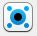
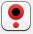

# Single Sentence Reading eye-tracking experiment

This script will walk you through the SingleSentenceReading.OS script and its eye-tracking functionalities. If you are not familiar with OpenSesame, visit their website [here](https://osdoc.cogsci.nl/) for different tutorials on how to code an experiment in OpenSesame. If this is your first eye-tracking experiment with OpenSesame, please first visit the [Basic Template script](https://github.com/erbadaya/ugent-eyetracking/tree/main/experimental-scripts/opensesame/BasicScript) in order to learn the basics of an eye-tracking experiment (i.e., connecting to the tracker, starting the recording). This walk thorugh will focus on the functionalities that are specific to an experiment where participants' are presented a single sentence on the screen and their taks is to read them. Therefore, we will discuss:

- How to define areas of interest that change size every trial.
- Change the position of the drift correct.
- Send each trial's set up (i.e., the image) to the tracker to the .edf file for later data pre-processing.

# The experiment

This experiment is based on [Rayner and Duffy's (1986)] Experiment 1, where they examined fixation times in reading as a function of word frequency, verb complexity and lexical ambiguity. In this case, we are working only with the materials where they manipulated word frequency: either high or low (e.g., The slow _music_ captured her attention v The slow _waltz_ captured her attention). There were three areas of interest: the word preceding the target word (in italics), the target word, and the word following the target word. We additionally add two more: The first word of the sentence and the rest of the sentence (i.e., five areas of interest). **Note** that this divide (esp. wrt IA_1 and IA_5) is appropriate for reading experiment, we are doing it for learning purposes. Likewise, these areas of interest should be larger vertically, but we are not covering that. 

Likewise, OpenSesame is not an ideal software for building an reading eye-tracking experiment. In particular, drawing areas of interest is a bit difficult given that they change size throughout the experiment, and that the tools we use to define them do not consider spaces between words. These obstacles are overcome by adding an invisible character between words (a great suggestion by Sebastian Mathôt [here]()). Likewise, note that the font of the text is not changed, but it might not be ideal for a reading experiment.

# The set up

This experiment runs on PsychoPy: You need to select it on experiment properties.

- Counterbalance (whether participants are in group 1 or group 2) via the form plug in.
- Present instructions about the calibration and validation procedures on a canvas.
- Initialise the tracker (i.e., establish the connection with the tracker and do a calibration and a validation).
- Present instructions about the experiment on a canvas.
- Import modules for saving stimuli and results.
- Start the experiment (i.e., the loop form, twice, one per group).
- The trial sequence:
  - Drift correction (shown where the sentence starts).
  - Start recording
  - Presentation of stimuli & sending areas of interest
  - Log variables in the .edf file
  - Log variables in the .csv file
  - Stop recording
- A goodbye screen

# The experiment code

1. Counterbalance

In this experiment, we have two lists of stimuli: For example, for stimuli 1, some participants will see the critical region in the high frequency condition (1a, e.g., The slow _music_ captured her attention) and some participants will see in the low frequency condition (1b, e.g., The slow _waltz_ captured her attention).

To do this, we will use the form plugin: At the beginning of the experiment, we are prompted to select a group 

2. Present instructions about the calibration and validation

To do so, we will use the canvas plugin. We will explain participants that before the experiment, we will calibrate the tracker: A series of dots will appear on the screen at random locations, and their task is to look at each dot until it changes position. 

3. Initialise the tracker

By initialising the tracker, we are doing two things: We are establishing a connection with the tracker (done automatically) and prompting the experiment to perform a calibration and a validation. We do this with the initalise plugin .

When you run the experiment in your own machine, remember to set this to 'Simple dummy' (or 'Advanced dummy', if you want to use your mouse as a mock tracker). By using simple dummy, you will avoid running the eye-tracking components - therefore, you will not be able to troubleshot any issues related to the eye-tracking parts.
When you test the script on the lab computer, remember to change this component to the tracker you are using (in , it's EyeLink)

1. Import modules plugin

As we explained in the beginning, this script requires a bit more of coding than previous ones. Specifically, because we are saving screenshots of each trial for our data pre-processing stage, we need to create a folder per participant where we are going to save the screenshot per trial (this gets referred to in the .edf file and it's then used when you are pre-processing your data in Data Viewer). To code this part, we are going to use the inline plugin .

To do so, we are going to use the ```os``` module (visit [this page](https://docs.python.org/3/library/os.html) to learn abut it). We are then going to create a folder for our participant (i.e., in the script called ```ppt_folder```, which will later appear as ```sub_X```in our experiment folder, where X is the subject number). We want to make ```ppt_folder``` a callable object throughout the entire experiment (as opposed to only in this step), which is why we first create it by calling ```global```. The entire code looks like this:

```
# All of this goes in the run tab

import os, pylink # we will need pylink later in the experiment
global ppt_folder

ppt_folder = os.makedirs(os.path.join(exp.experiment_path, "sub_" + str(var.subject_nr))) # first, we create the directory with the function os.makedirst, which takes the directory of where our experimental script is saved, and adds a new folder named "sub_" and the participant number, saved in "subject_nr"

ppt_folder = os.path.join(exp.experiment_path, "sub_" + str(var.subject_nr)) # we then save this path in our object, to later call it to save the images
```

Additionally, we are going creating  global canvas and keyboard, which we will use for presenting stimuli.

```
global reading_canvas, my_keyboard

reading_canvas = canvas(exp)
my_keyboard = keyboard(exp)
```

1. The loop item (i.e., presentation of stimuli)

To better understand this plugin and its function within the experiment, visit [this page](https://osdoc.cogsci.nl/4.0/manual/structure/loop/). In our experiment, we have divided the sentence into areas of interest - where each area of interest is one column (which we will later on use to present the text and to draw the areas of interest). Further columns include the condition (high/low), an identifier per sentence, type (critical/filler, for example), and counterbalance (1/2).

1. The trial sequence

To better understand this plugin and its function within the experiment, visit [this page](https://osdoc.cogsci.nl/4.0/manual/structure/sequence/).

5.1. Drift correction

We are going to use the pygaze drift correct plugin . In previous scripts (i.e., Basic Script, VWP) we are not changed its settings.

In this case, however, we can to change its position: In reading experiment, we want the drift correction to appear on the place where the first word of the sentence will appear (to avoid biases in fixations when we analyse our data). In this case, we know that the sentence will appear in the center vertically (i.e., y position = 0), but to the left on the horizontal axis: Specifically, we have set it to -416 (x position = -416). This may depend on your stimuli and script.

5.2. Start recording

Once we have performed a drift correction, we can start recording eye movements within the trial. We do this by using the pygaze start recording plugin .

5.3. Presentation of stimuli and recording areas of interest

The most straightforward way for us to present the text on the screen would be to call the canvas plugin and refer to each part of our sentence (as named in the loop plugin). However, this has several drawbacks: How do we know how much space each part takes on the canvas? Where should each part start on the x-axis? 

To solve this problem and simultaneously add more functionalities that we need for the experiment (namely, definining areas of interest and sending each trial's image to the .edf file), we are going to use an inline script plugin . Note that this requires some (very basic, but some nonetheless) Python knowledge. You may want to visit [this page](https://osdoc.cogsci.nl/4.0/manual/python/var/) to fully understand how to call variables in Python etc., and [this page](https://osdoc.cogsci.nl/4.0/manual/prepare-run/) to understand the difference between the _prepare_ and the _run_ tab in this plugin.

5.3.1. The prepare tab

In this tab, we are setting up the stimuli to then run them in the run tab.

We first want to bring each part of the sentence to be able to drawn them. This information is stored in the loop plugin: Each part of the sentence (i.e., each _area of interest_) in a column. Each sentence in our experiment has five areas of interest, so we have five columns (i..e, IA_X) that we need to call.

```
part1 = var.IA_1
part2 = var.IA_2
part3 = var.IA_3
part4 = var.IA_4
part5 = var.IA_5
```

5.3.2. The run tab

We can now present our stimuli and draw areas of interest. We are going to repeat these steps as many times as areas of interest we have (in this case, five). Basically, we need to know how much space each part of the sentence takes on the screen. For that, we can use the ```rect()``` function (which works on a canvas object). This function takes a piece of text (e.g., ```part1```) and returns its x and y axis, as well as its width and height. With these values, we can do two things: (1) draw the area of interest and (2) calculate where the next text should be presented. 

Let's start with the first area of interest ('The') in this case. To draw it, we call this syntax:

```
reading_canvas['IA1'] = Text(part1, center = False, x = -416, y = 0, html = True)
```

x is where the text should be drawn, because we have set ```center``` to false, it means the left-side of the text. 

```
x, y, w1, h1 = reading_canvas['IA1'].rect
```

Now we have the x, y coordinates of the text, and its width and height on the screen. We only need ```w1``` and ```h1```. Let's move to our second area of interest:

Firstly, we want to have a space between the two words. To do that, we are going to create an invisible character (we do so by setting it to the same colour as the background). The logic is the same: We draw it, and then we draw a rectangle around it. We will do this four times (one per area of interest except for the last one).

```
reading_canvas['_1'] = Text("n", center = False, x = -416 + w1, y = 0, color = 'white') #note that it takes as the start -416 _plus the size of our first area of interest

x1u, y1u, w1u, h1u = reading_canvas['_1'].rect

```
We can now move onto our second area of interest:

```
reading_canvas['IA2'] = Text(part2, x = -416 + w1 + w1u, y = 0, center = False)
``` 
The syntax is the same, but we add the width of our first area of interest and the first invisible space to ```x```, so that this second part of the sentence appears where the first one ends. Then we get its values:

```
x, y, w2, h2 = reading_canvas['IA2'].rect
```

Once we have done this five times (one per area of interest), we can now also calculate the spaces for the areas of interest to send to the tracker. Remember that the coordinate systme in Data Viewer (and for EyeLink) differs from that of OpenSesame: While 0,0 for the latter is the middle of the screen, 0,0 in EyeLink is the top, left corner of the screen. 

To define areas of interest, we pass to the tracker the coordinates of a rectangle (in this case). Specifically, we pass the coordinate of the center of the left side, center of the top side, center of the right side, and center of the bottom side. Therefore, to get these coordinates, we also need to know the width and height the text we are presenting occupies on the screen.

This means we need to transform our -416 (for the x-coordinate) to the new coordinate system: In this case, it is 554. We also need to transform the y-coordinate (0), which becomes 544. For the widths of each area of interest, we need to do calculations akin to those we did for getting the starting point on the screen for each area of interest (note that you also need to add the invisible spaces!). For the heights of each area of interest, we need to work with the hX values we got and add them to 384.

```
start_IA_left = 544

part1_left = start_IA_left 
part1_right = start_IA_left + w1
part1_top = 540 + h1
part1_bottom = 540 - h1

part2_left = start_IA_left + w1 + w1u
part2_right = start_IA_left + w1 + w1u + w2
part2_top = 540 + h2
part2_bottom = 540 - h2

part3_left = start_IA_left + w1 + w1u + w2 + w2u
part3_right = start_IA_left + w1 + w1u + w2 + w2u + w3
part3_top = 540 + h3
part3_bottom = 540 - h3

part4_left = start_IA_left + w1 + w1u + w2 + w2u + w3 + w3u 
part4_right = start_IA_left + w1 + w1u + w2 + w2u + w3 + w3u + w4 
part4_top = 540 + h4
part4_bottom = 540 - h4

part5_left = start_IA_left + w1 + w1u + w2 + w2u + w3 + w3u + w4
part5_right = start_IA_left + w1 + w1u + w2 + w2u + w3 + w3u + w4+ w4u + w5
part5_top = 540 + h5
part5_bottom = 540 - h5
```

We can now draw our text on the screen

```
reading_canvas.show()
```

We are going to send the areas of interest to the tracker. We do this by using the function ```pygaze_eyetracker.log('!V IAREA RECTANGLE 1 {0} {1} {2} {3} PART1)```, where {0}, {1}, {2}, {3} refer to the right side, top side, left side, and bottom side of our area of interest (i.e., what we calculated at the end of the prepare tab). We are going to call this five times, because we have five areas of interest. Note that the {X} syntax means we are formatting the string(see [here]()). The code goes as follows:

```
exp.experiment.pygaze_eyetracker.log('!V IAREA RECTANGLE 1 {0} {1} {2} {3} PART1'.format(part1_right,part1_top,part1_left,part1_bottom))
exp.experiment.pygaze_eyetracker.log('!V IAREA RECTANGLE 2 {0} {1} {2} {3} PART2'.format(part2_right,part2_top,part2_left,part2_bottom))
exp.experiment.pygaze_eyetracker.log('!V IAREA RECTANGLE 3 {0} {1} {2} {3} PART3'.format(part3_right,part3_top,part3_left,part3_bottom))
exp.experiment.pygaze_eyetracker.log('!V IAREA RECTANGLE 4 {0} {1} {2} {3} PART4'.format(part4_right,part4_top,part4_left,part4_bottom))
exp.experiment.pygaze_eyetracker.log('!V IAREA RECTANGLE 5 {0} {1} {2} {3} PART5'.format(part5_right,part5_top,part5_left,part5_bottom))
```

<details>
<summary>Isn't all this code a bit repetitive?</summary>
<br>
Yes it is! You could instead create a function (in the import module inline script) and call it here (something similar is done in the Visual World Paradigm examples) and then call the function in inline script inside the trial sequence (inside a loop, one per area of interest). 

The important part in that script is: How do you update the starting position of each area of interest? 
</details>

The next steps of the code will help us save the trial screenshot and send it to the .edf for later pre-processing (e.g., you may want to correct fixations vertically/horizontally, or check whether fixations where on particular areas of interest, and this is easier done if you can see the text on the software).

For doing this, we are going to use the functions ```getMovieFrame()``` and  ```moveFrames[].save()```. Note that these functions work on a ```window``` object that is from PsychoPy: Therefore, your experiment needs to run on PsychoPy (i.e., in the experiment first tab).

```
self.experiment.window.getMovieFrame() # takes a screenshot of the canvas

scn_name = var.item + '.png'
filepath = os.path.join(ppt_folder, scn_name)
self.experiment.window.saveMovieFrames(filepath)
```

Now that we have taken the screenshot and saved it in the folder, we can refer send it to the tracker. We do this with the syntax ```sendMessage('!V IMGLOAD FILL %s' % filepath)```. Further. ```sendMessage()``` belongs to the ```pylink``` module, meaning that we need to import it (again, done in the import_module plugin) and create an eye-tracker object.

```
el = pylink.getEYELINK()

bgcolor = (116, 116, 116)
el.sendMessage('!V CLEAR %d %d %d' % bgcolor)
el.sendMessage('!V IMGLOAD FILL %s' % filepath )
```

Finally, we wait until the participant performs a response with the keyboard and then we clean the screen.

```
my_keyboard.get_key()
#clean the screen
self.experiment.window.flip()
```

5.4. Log variables in the .edf file

At the end of each trial we want to save information in the .edf file (e.g., what trial it was, condition, etc.). We do this with the pygaze log plugin . Note that although you could automatically log all variables (by selecting this option), it is not recommendable: First, because you will save unnecessary information and secondly - and most importantly - because it can disrupt your intertrial interval: Logging in _all_ variables creates a delay. Therefore, you should write only record those variables that are of interest for you by using the script in this plugin and the following syntax: ```
!V TRIAL_VAR variable [variable]```, where the variable within brackets is the name of the variable in the experiment, and the variable outside is the name with which we want to save it in the eye-tracking data. 

In this experiment, for example, I want to save sentence, condition, counterbalance, type and identifier, so I write down the following:

```
!V TRIAL_VAR condition [condition]
!V TRIAL_VAR counterbalance [counterbalance]
!V TRIAL_VAR type [type]
!V TRIAL_VAR identifier [identifier]
```

5.5. Log variables in the .csv file

We also want to save all the trial information in the behavioural file (the .csv file). We do this with the logger component.

5.6. Stop the recording.

At the end of each trial, we stop recording eye-tracking data. This will segment the data to mark when the trial ended. We do it by adding the pygaze stop recording plugin.

1. Goodbye screen

Once our participants have gone through all the selected rows of our loop (e.g., all, a section, depending on what we specify), we want to show them a goodbye screen to thank them for their time and inform them the experiment is over. We do this with a canvas plugin.

Note that participants will only see the loop group1 or group2 depending on what we select in the counterbalance form. Those in group1 will skip the group2 loop, and the inverse. However, the trial sequence in group1 and group2 loops is identical: Unless you want to make any difference in trials per counterbalancing group, you may want to copy and paste the sequence of one group to the other.

Happy coding!