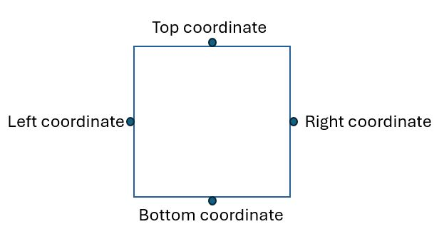
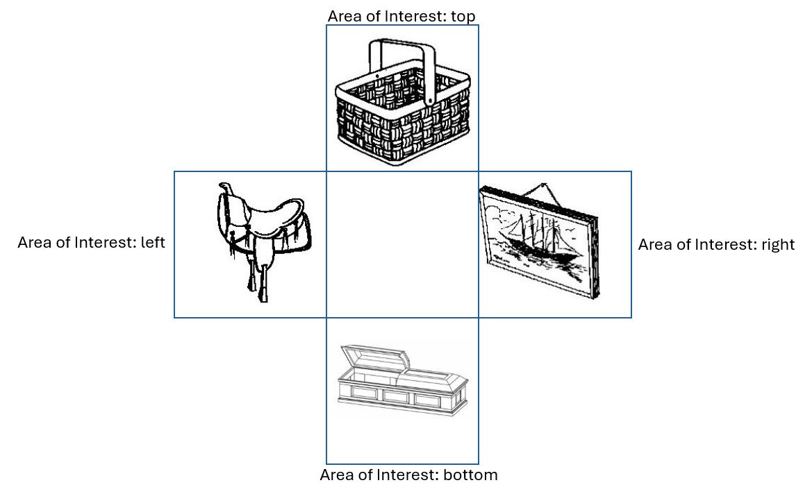
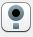

# Visual World Paradigm eye-tracking experiment

This script will walk you through the VWPAllopena.OS script and its eye-tracking functionalities. If you are not familiar with OpenSesame, visit their [website](https://osdoc.cogsci.nl/) for different tutorials on how to code an experiment in OpenSesame. If this is your first eye-tracking experiment with OpenSesame, please first visit the [Basic Template script](https://github.com/erbadaya/ugent-eyetracking/tree/main/experimental-scripts/opensesame/BasicScript) in order to learn the basics of an eye-tracking experiment (i.e., connecting to the tracker, starting the recording). This walk thorugh will focus on the functionalities that are specific to a VWP experiment: defining areas of interest and sending triggers.

This approach is slightly different than that described in the Visual World Paradigm tutorial of OpenSesame (especially when it comes to defining Areas of Interest). 
This script is meant to rely more on plugins and less on Python code, yet we will use Python for sending triggers and defining ROIs. We will use the inline_script plugin 

**Note**: To alleviate the need to learn Python for this walk through, there are parts of this experimental design that are not ideal. Namely, locations of images is pseudo-randomised: We have set in the experiment_sequence the location of each image by trial, and each trial is presented randomly. 

# The experiment

This task is a short conceptual replication of [Allopena et al. (1995)](), where they examined the time course of lexical access of a given word. In their experiment(s), participants were shown the target word, an object that phonologically overlapped with it (i.e., its cohort competitor), an object that rhymed with it, and an unrelated object. This experiment is a simplification of theirs (e.g., no familiarisation phase, fewer items on screen, shorter instructions). In our experiment participants are shown four images on the screen for 1000 ms, and then they hear an instruction referring to one of the objects on the screen ("Pick up the [target]"). 

# The set up

- A welcome screen on a canvas.
- An inline script for sending areas of interest to the tracker for later analysis.
- Initialise the tracker (i.e., establish the connection with the tracker and do a calibration and a validation).
- Start the experiment (i.e., the loop form).
- The trial sequence:
  - Drift correction (shown in the middle of the screen).
  - Start recording
  - Show the visual stimuli for 2000 ms without any audio (the preview window).
  - Send a trigger (i.e., a message for the tracker) indicating the start of the preview window.
  - Send the areas of interest to the tracker.
  - Play audio
  - Send triggers for each part of the audio that is relevant for later analysis.
  - Show a screen for participants to click on.
  - Log variables in the .edf file
  - Log variables in the .csv file
  - Stop recording
- A goodbye screen

# The experiment code

1. Welcome screen

The script starts with a welcome screen. Usually, this is where the task is explained to participants and the calibration and validation procedures are introduced.

2. Initialise the tracker

By initialising the tracker, we are doing two things: We are establishing a connection with the tracker (done automatically) and prompting the experiment to perform a calibration and a validation. We do this with the initalise plugin .

3. The loop (i.e., presentation of stimuli)

To better understand this plugin and its function within the experiment, visit [this page](https://osdoc.cogsci.nl/4.0/manual/structure/loop/). In summary, the loop contains all our trials (i.e., each row is a trial, each column is a variable).

In our experiment, we have three columns per item on the screen:

- OX (where X is 1, 2, 3, 4) is the image shown.
- OX_type is the type of the stimulus (referent, cohort, rhyme, unrelated)
- OX_pos is the position of the stimulus (top, right, left, bottom). Note that this means that in this script, position is pseudo-randomised.

Additionally, we have:
- A column for the first part of the audio (instruction_audio)
- A column for the audio file containing the referent (target_audio)
- set_type and target_type: see Allopenna et al.'s paper

4. The trial sequence

To better understand this plugin and its function within the experiment, visit [this page](https://osdoc.cogsci.nl/4.0/manual/structure/sequence/). In summary, these is where we put the elements in sequence that configure a trial.

4.1. Drift correction

We start with a drift correction, via the plugin 

4.2. Start recording

Once we have performed a drift correction, we can start recording eye movements within the trial. We do this by using the pygaze start recording plugin .

4.3. The preview window

Because of how OpenSesame works with plugins, we have two canvases for visual stimuli: the preview window, and the response_screen. The preview window presents the four visual stimuli and stays on for 2000 ms (our preview window). We will use the response_screen to record participants' click on items once audio has finished playing.

Specifically, we are going to use if - else statements in the script part of the canvas plugin, so that we will look into the experiment_sequence loop, and show change dynamically what is shown in what area with a combination of the OX images and OX_pos:

```
draw image center=1 file="[O1]" scale=1 show_if=True x="[=-190 if 'left' in var.O1_pos else 190 if 'right' in var.O1_pos else 0]" y="[=-190 if 'top' in var.O1_pos else 190 if 'bottom' in var.O1_pos else 0]" z_index=0
draw image center=1 file="[O2]" scale=1 show_if=True x="[=-190 if 'left' in var.O2_pos else 190 if 'right' in var.O2_pos else 0]" y="[=-190 if 'top' in var.O2_pos else 190 if 'bottom' in var.O2_pos else 0]" z_index=0
draw image center=1 file="[O3]" scale=1 show_if=True x="[=-190 if 'left' in var.O3_pos else 190 if 'right' in var.O3_pos else 0]" y="[=-190 if 'top' in var.O3_pos else 190 if 'bottom' in var.O3_pos else 0]" z_index=0
draw image center=1 file="[O4]" scale=1 show_if=True x="[=-190 if 'left' in var.O4_pos else 190 if 'right' in var.O4_pos else 0]" y="[=-190 if 'top' in var.O4_pos else 190 if 'bottom' in var.O4_pos else 0]" z_index=0
```

If you want to learn more about the canvas plugin, look [here](https://osdoc.cogsci.nl/4.0/manual/stimuli/visual/).

4.4. Inline script: Trigger_preview

We want a trigger (i.e., a message in the .edf file) marking when the images are shown. To do this, we have an inlien script plugin we will have an inline script plugin (which, in fact, is sent _before_ the canvas plugin -- otherwise, it would be sent 2000 ms after the images are shown). In the inline script, we are using the function `pygaze_eyetracker.log()` to send our triggers. Note that we write `exp.` before the function, and the text for the trigger within quotation marks. When sending triggers, make them consistent: 
   
```
exp.pygaze_eyetracker.log('preview_window')
```

4.5. Audio presentation and triggers

After 1000, we will present the instructions. We want to mark three events in our eye tracking data: When audio starts, when our target starts, and when our target ends. In this code, we have worked around this issue by recording the sentence in its enterity, and then splicing it into two audios, with triggers being sent around them. Other researchers may prefer to have the audio play in its enterity, and time when each part occurs within the sound file, and send the trigger when that time is met. When splicing audios you need to be consistent (e.g., do not take the space between the word prior to the target noun as part of the noun soundfile) and ensure that the cut is not noticeable (e.g., do not cut after the first phoneme has began). Besides this, no way is better than the other: I have coded it this way because I prefer spending more time preparing the audios than ensuring that times are correct.

Therefore, the script now has:
  - One inline script
  - One audio
  - One inline script
  - One audio
  - One inline script

In the inline script, we are using the function `pygaze_eyetracker.log()` to send our triggers. Note that we write `exp.` before the function, and the text for the trigger within quotation marks. When sending triggers, make them consistent: 

```
exp.pygaze_eyetracker.log('trigger')
```

We send the trigger before the audio plugin; otherwise, it would be sent _after_ the audio is played.

4.5. Response canvas and collect responses

Once the audio is played, participants are allowed to click on the object mentioned. We do this by creating a new canvas (response_scene) and linking a mouse component (object_click) to it.

4.7. Inline script: send_areas of interest

For sending areas of interest we need a bit of coding in Python. We need to tell the tracker where our visual stimuli are presented on the screen: In this case, we will be defining our areas of interest as rectangles. The syntax looks like this:

```
exp.pygaze_eyetracker.log('!V IAREA RECTANGLE {0} {1} {2} {3} {4} {5}'.format(index+1, coords[0], coords[1], coords[2], coords[3], region))
```
Where:

    - 0 is the index of the area of interest. In this case we have four areas of interest.
    - 1, 2, 3 and 4 refer to the left-center, top-center, right-center, and bottom-center points of our Area of Interest
    - 5 is the region (or label) of this Area of Interest



To calculate the four points to draw the rectangle per each area of interest, we need to consider the coordinate system of the tracker and how our visual stimuli are placed on the screen. Regarding the former, the coordinate systme in Data Viewer (and for EyeLink) differs from that of OpenSesame: While 0,0 for the latter is the middle of the screen, 0,0 in EyeLink is the top, left corner of the screen. This means that we need to translate the position of our stimuli to this new coordinate system. As for the latter, when we defined the position of our visual stimuli, we passed on the coordinate where the _center_ of the image is: For example, for the picture on the top position, that is x = 0, y = -190. 

Therefore, to calculate the four coordinates to draw the rectangle we first need to translate the center of the stimuli to the new coordinate system and then to calculate the displacement from the center to the edges of the image. The first part is easy: we need to add half of the width of the screen for the x-coordinate, and half of the height of the screen for the y-coordinate. This means that x = 0, y = -190 becomes x = 512 y = 194 (for a resolution of 1028 x 768). The displacement is calculated by substracting (for the left and top coordinates) or adding (for the right and bottom coordinates) half of the width (for right and left) and height (for top and bottom) of our images. In the Visual World Paradigm, is it likely that all your images have the same size, so you would only need to do these calculations once (as opposed to, for example, areas of interest whose size change across trials, see for example the SingleSenteceReading experiment). In this case, all of the stimuli used are 189x189, so we know the coordinates will only change as a function of the position, but not also of the stimuli. Therefore, the formula in our case goes:

```
**x_coordinate** + 512-0.5 * 189 # where 512 is half of the screen horizontally, minus half of the size of our pictures, so we get the left margin (values increase left to right of the screen)
**y_coordinate** + 384-0.5*189 # where 384 is half of the screen vertically, minus half of the size of our pictures, so we get the top margin (values increase top to bottom of the screen)
**x_coordinate** + 512+0.5 * 189 # where 512 is half of the screen horizontally, minus half of the size of our pictures, so we get the right margin (values increase left to right of the screen)
**y_coordinate** + 384+0.5*189 # where 384 is half of the screen vertically, minus half of the size of our pictures, so we get the bottom margin (values increase top to bottom of the screen)
```

The values of these four coordinates for the position at the top are:

```
# for a picture shown in the top, center of the screen

# left margin: 0 + 512 - 0.5*189 = 417.5
# top margin: -190 + 384 - 0.5*189 = 99.5
# right margin: 0 + 512 + 0.5*189 = 606.5
# bottom margin: -190 + 384 + 0.5*189 = 288.5
```

And the syntax to draw this area of interest is:

```
exp.pygaze_eyetracker.log('!V IAREA RECTANGLE 1 417.5 99.5 606.5 288.5 "top"')
```

We would need to repeat this step three more times (as we have four images on the screen), so we can send the following information to the tracker:



If you do the math, the syntax would be:

```
exp.pygaze_eyetracker.log('!V IAREA RECTANGLE 1 417.5 99.5 606.5 288.5 "top"') # top center

exp.pygaze_eyetracker.log('!V IAREA RECTANGLE 2 607.5 289.5 796.5 478.5 "right"') # right center

exp.pygaze_eyetracker.log('!V IAREA RECTANGLE 3 417.5 479.5 606.5 668.5' "bottom"') # bottom center

exp.pygaze_eyetracker.log('!V IAREA RECTANGLE 4 227.5 289.5 416.5 478.5 "left"') # left center
```

Technically, this is it for sending areas of interest. There is, however, two point to bear in mind:

- Our syntax also sends a label. In this case, the label refers to where on the screen the area of interest is (i.e., top, right, bottom, left). However, when for analysis, what we need to know is _what was shown in each area_. We are saving that information in the file, but this code entails that we will need to re-assign areas of interest during data pre-processing: You will need to know what was shown in each position (e.g., referent, distractor) and create a new column for fixations to objects as opposed to locations on the screen. Since this script is less heavy on Python, we went for this approach, but if you're interested in how to put labels dynamically, have a look at how it's done in the VWPAllopenaPy.os.


<details>
<summary>How can I make this more efficiently?</summary>
<br>

There isn't a problem with the code above, but it's clearly _a lot_ of code. Instead of doing the calculations manually area per area, and then feeding them into the formula, you could wrap this in a function.

```
def write_tracker(index):
	poslist = [(-190, 0), (0, 190), (190, 0),(0, -190)] # the position of our stimuli
	areas = ["left", "bottom", "right", "top"] # the areas of the stimuli
	pos = poslist[index]

	## remember the problem we with defining IA in the eye tracker. eye tracker origin is in the top left

	coords = (pos[0] + 512-0.5*189, pos[1]+384-0.5*189, 
			  pos[0]+512+0.5*189, pos[1]+384+0.5*189)

	region = areas[index]

	self.experiment.pygaze_eyetracker.log('!V IAREA RECTANGLE {0} {1} {2} {3} {4} {5}'.format(index+1, coords[0], coords[1], coords[2], coords[3], region))
```

You would add this function at the beginning of your script (e.g., after the welcome screen) in the Run tab of an inline script plugin. Then, within the trial sequence, you would add another inline script after the canvas presenting the visual stimuli and add this in the Run tab:

```
for i in range(4):
	write_tracker(i)
```

You would be doing the same as above, but with fewer lines! 

</details>


4.8. Log in variables in the .edf

t the end of each trial we want to save information in the .edf file (e.g., what trial it was, condition, etc.). We do this with the pygaze log plugin . Note that although you could automatically log all variables (by selecting this option), it is not recommendable: First, because you will save unnecessary information and secondly - and most importantly - because it can disrupt your intertrial interval: Logging in _all_ variables creates a delay. Therefore, you should write only record those variables that are of interest for you by using the script in this plugin and the following syntax: ```
!V TRIAL_VAR variable [variable]```, where the variable within brackets is the name of the variable in the experiment, and the variable outside is the name with which we want to save it in the eye-tracking data. 

4.9. Log variables in the .csv file

We also want to save all the trial information in the behavioural file (the .csv file). We do this with the logger component.

4.10. Stop the recording

At the end of each trial, we stop recording eye-tracking data. This will segment the data to mark when the trial ended. We do it by adding the pygaze stop recording plugin.

1. At the end of our experiment, we show participants a good bye screen.
  

And that's it!